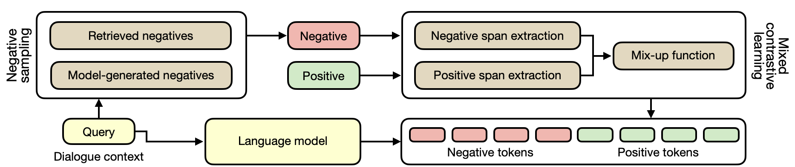

# Contrastive Learning Reduces Hallucination in Conversations

Code for paper [Contrastive Learning Reduces Hallucination in Conversations](https://arxiv.org/abs/2212.10400).

We propose *MixCL*, a contrastive learning framework to reduce the hallucination of LM-based knowledge-grounded dialogue systems.



## Models
The code for extrating spans is available at `mixup.py`, where we use  [stanza](https://github.com/stanfordnlp/stanza/) and  [spacy](https://github.com/explosion/spaCy) to identify entities and constituencies in text.

The code for model training and testing is available at `run.py`

## Datasets
The dataset (i.e., [Wizard-of-Wikipedia](https://parl.ai/projects/wizard_of_wikipedia/)) is placed in `/dataset`, and `/utils` provides the code for IO and evaluation. 
- Code for dataset pre-processing: https://github.com/sunnweiwei/GenKS/blob/main/process_wizard.py
- Pre-processed datasets are shared at https://drive.google.com/file/d/1ccPi-f8x_yqvVkGVN8rnNkkevrVFyY3D/view?usp=drive_link

## Evaluation
We provide an example of the outputs of models on WoW seen at `outputs_on_seen.txt`

## Cite
```
@inproceedings{Sun2023ContrastiveLR,
  title={Contrastive Learning Reduces Hallucination in Conversations},
  author={Weiwei Sun and Zhengliang Shi and Shen Gao and Pengjie Ren and M. de Rijke and Zhaochun Ren},
  booktitle={AAAI Conference on Artificial Intelligence},
  year={2023},
  pages={13618--13626}
}
```


